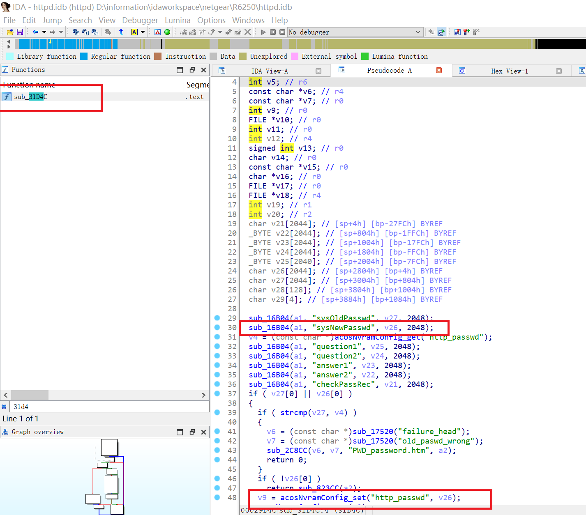
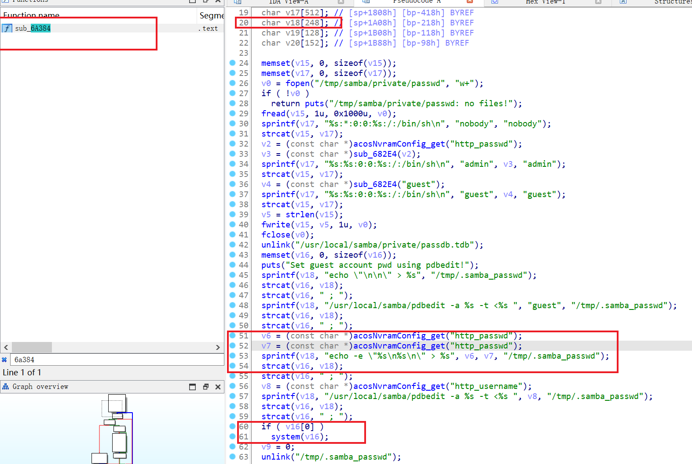

# SMB smb_pass Buffer Overflow & Command Injection Vulnerabilities

An authenticated attacker may leverage http_passwd field in nvram to trigger command injection and buffer overflow vulnerabilities to execute arbitary commands when httpd invoking smb_pass command.

## Affected Product & Versions

Following are versions where we found the vulnerabilities. Other versions may also be vulnerable.

* [R6250](https://www.netgear.com/support/product/dc112a)
  * [1.0.0.48](https://www.netgear.com/support/download/?model=R6250) Latest

## The Vulnerability

First, in function sub_31D4C(),the attacker can set `http_passwd` parameter in nvram via password.cgi

Then, when the system set smb password with smb_pass, there is a potential buffer overflow and command injection vulnerability. Attackers can set the password to a long enough string, e.g., `'a' * 0x200` to trigger buffer overflow; or they can set the password to `';$(CMD)'` to execute arbitary command to take the full control of the system.

## Timeline