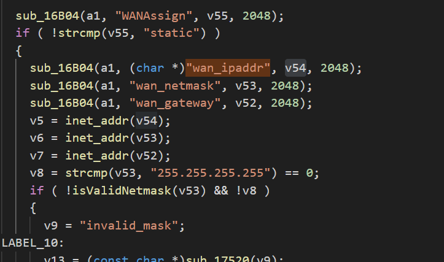
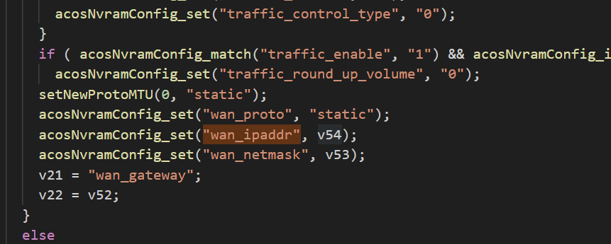
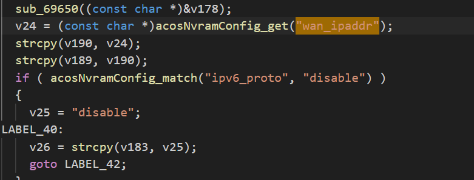

First, in function 1E5B4, "wan_ipaddr" is obtained through sub_16B04() and stored in v54, then the value of v54 is stored in nvram, and then the value of nvram is read. Finally, strcpy() assigns the value to variable v190, causing a buffer overflow. 
  
  
  